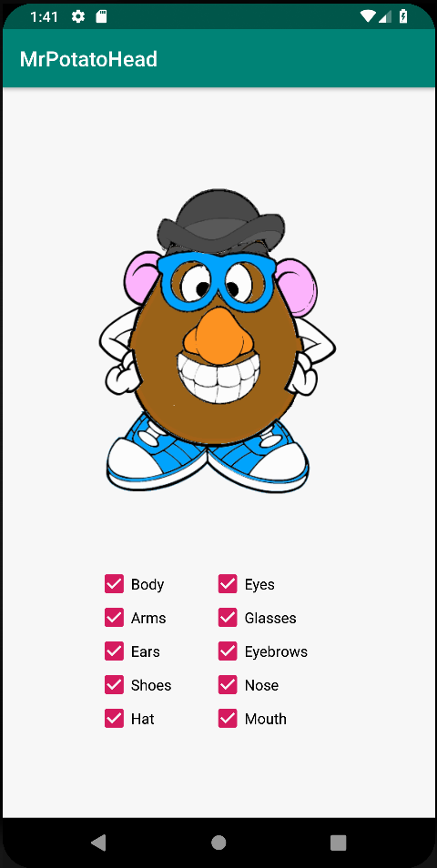
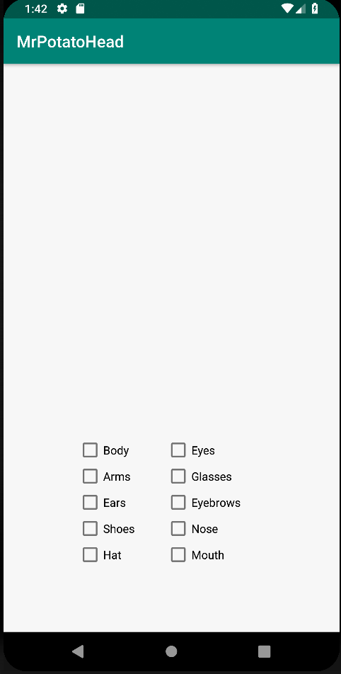
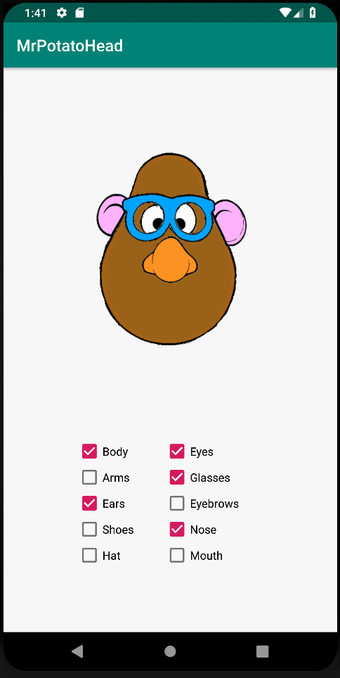
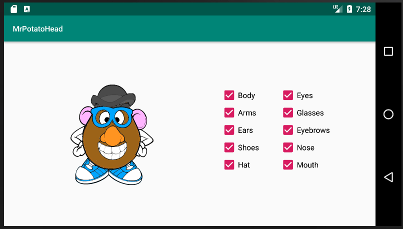
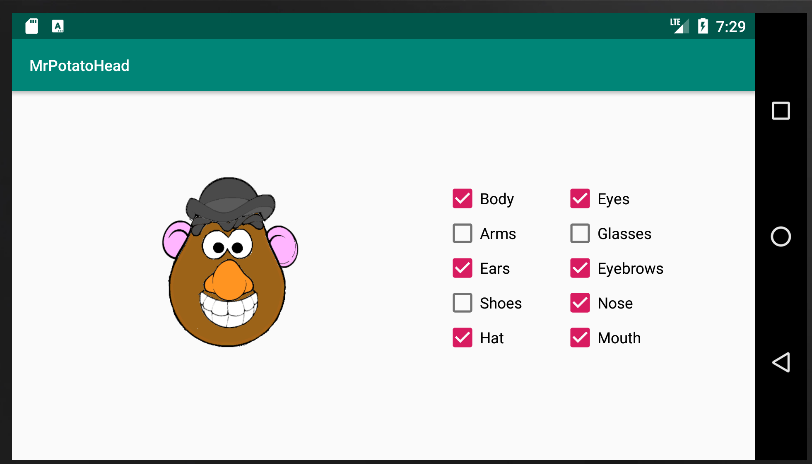

Dit is mijn MR potatohead app.

Door de checkboxes te selecteren kan je nieuwe lichaamsdelen laten verschijnen/verdwijnen
Ik heb een landscape mode toegevoegd en de onsaveinstance geimplemnteerd zodat de plaatjes blijven
staan wanneer het scherm gedraait wordt.

